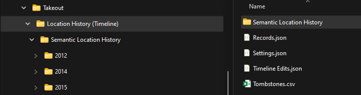
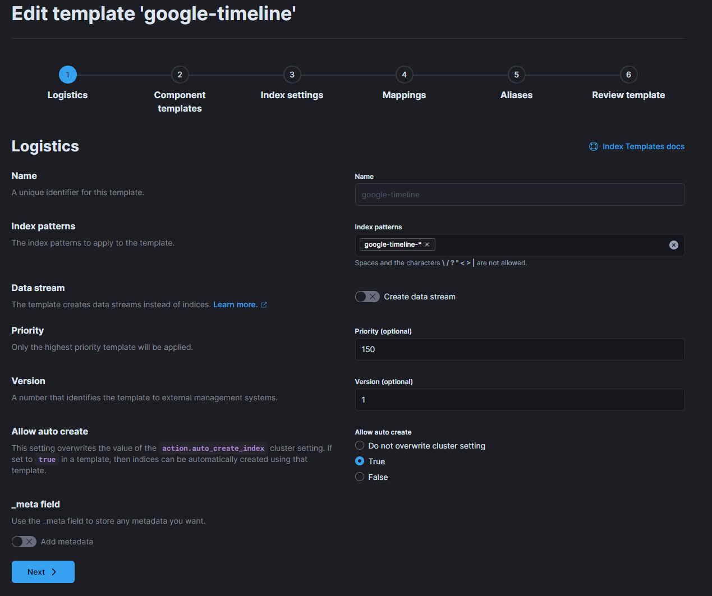
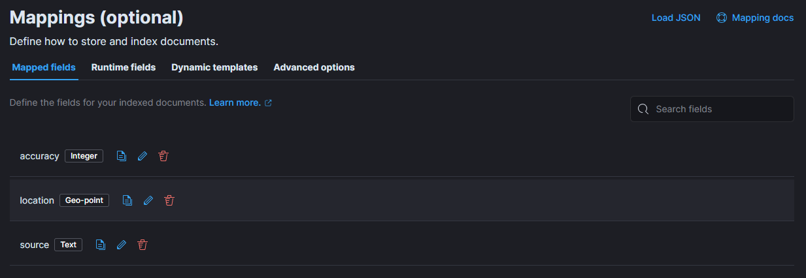

# Google Location History and ElasticSearch Shenanigans

This repository was inspired by [Google Takeout Fun](https://github.com/hendrikb/google_takeout_fun), which I used around a year ago.

This year, partly as a result of Google ending support for on-line location history, I decided to revisit this.

## Why was I doing this?

For my day job I spend quite a bit of time with ElasticSearch, and my employer paid for ElasticSearch training. In order to re-inforce some of the knowledge, I decided to have a play around with location data in order to complete my taxes.

In Australia, in response to the COVID-19 Pandemic, the Australian Taxation Office (ATO) allowed people to claim _Working from Home_ expenses using a simplified method that is calculated based on the number of hours worked from home.
This requires one to either track which days, and how many hours on each day, were worked from home. I have a somewhat complicated situation. I am on-call for our core platforms most of the time. When I get called out-of-hours, this counts as
working from home, just like when I carry out my normal daytime work from home. Thankfully (to some extent), we have to complete timesheets that record our time worked. I can use this data as a baseline for hours worked. I just need to work out
which days (daytime) I worked from home, and which days I was in the office. This is where the Google Location History comes in.

## Google Location History - Takeout Request

You cannot directly query Google Location History for information about when you were near a location during a particular period. This is where ElasticSearch comes in, but you need to be able to import it.
For this you need to complete a takeout request.

### Prerequisite

In your Google Account activity settings page you have to have Location History enabled. This has been deprecated by Google as of this year (2024), and in future all location data will be stored on the device that collects it.

Disclaimer: This will allow Google to track your physical location on your mobile devices. They will store that data and present it to you through their Google Maps Timeline Page! Do not use this feature unless you are willing to share your 24/7 location data with that Company or their partners. Read their official documentation, TOCs and privacy statements! Be aware, you are sacrificing good parts of your privacy. Don't even think about enabling this feature on other people's accounts without their explicit knowledge and acknowledgement! You have been warned.

We will download that data set in the next step in order to work with it.

### Get your Data from Google

Head over to [Google Takeout](https://takeout.google.com/settings/takeout) and schedule your "Location History" Download in JSON format.

This will take a while, once it's done you will receive a notification. Download the file, extract the archive somewhere. It will contain a structure similar to the following:



In previous years the file we are interested in (when your language is set to English) was called **Location History.json**, now it is simply called **records.json** along with a couple of other files, the internal structure appears to be the same.
There are other files in the takeout data, such as the structure by Year under _Semantic Location History_, which appears to be more like what the Timeline Web Page actually showed you: What locations you visited, what mode of transport you used,
what route you took.

### Dataset Size

Depending on how long you have had your _Location History_ enabled, the dataset will likely be too large to work with in one lump. For myself, 70,000 records represented around 4.5 months of location history. In my case I have around 12 years of Google knowing exactly where I have been. I cannot easily count how many total records that amounts to yet (Elasticsearch will help with that).

We need to find a way to break up the dataset into more manageable chunks. The **records.json** file just contains an array of _locations_:

```json
{
  "locations": [
    {
      "latitudeE7": -379007934,
      "longitudeE7": 1451309189,
      "accuracy": 20,
      "source": "WIFI",
      "timestamp": "2012-07-23T04:23:28.179Z"
    },
    {
      "latitudeE7": -379013259,
      "longitudeE7": 1451309281,
      "accuracy": 20,
      "source": "WIFI",
      "timestamp": "2012-07-23T04:33:28.901Z"
    }
  ]
}
```

Additionally, the amount of data in the records changes over time as Google changed the ways in which the location data was tracked (I have obfuscated the data, so it may not make sense).

```json
{
  "locations": [
    {
      "latitudeE7": -379007934,
      "longitudeE7": 1451309189,
      "accuracy": 13,
      "altitude": 38,
      "verticalAccuracy": 1,
      "activity": [
        {
          "activity": [
            {
              "type": "UNKNOWN",
              "confidence": 41
            },
            {
              "type": "IN_VEHICLE",
              "confidence": 10
            },
            {
              "type": "ON_BICYCLE",
              "confidence": 10
            },
            {
              "type": "ON_FOOT",
              "confidence": 10
            },
            {
              "type": "STILL",
              "confidence": 10
            },
            {
              "type": "WALKING",
              "confidence": 10
            },
            {
              "type": "RUNNING",
              "confidence": 10
            },
            {
              "type": "IN_ROAD_VEHICLE",
              "confidence": 10
            },
            {
              "type": "IN_RAIL_VEHICLE",
              "confidence": 10
            }
          ],
          "timestamp": "2024-07-07T04:37:07.229Z"
        }
      ],
      "source": "WIFI",
      "deviceTag": 123456789,
      "platformType": "ANDROID",
      "activeWifiScan": {
        "accessPoints": [
          {
            "mac": "12345678901234",
            "strength": -41,
            "frequencyMhz": 0
          },
          {
            "mac": "123456789012",
            "strength": -47,
            "frequencyMhz": 0
          },
          {
            "mac": "12345678901235",
            "strength": -66,
            "frequencyMhz": 0
          },
          {
            "mac": "12345678901236",
            "strength": -75,
            "frequencyMhz": 0
          },
          {
            "mac": "12345678901237",
            "strength": -83,
            "frequencyMhz": 0
          },
          {
            "mac": "12345678901238",
            "strength": -86,
            "frequencyMhz": 0
          },
          {
            "mac": "12345678901239",
            "strength": -86,
            "frequencyMhz": 0
          }
        ]
      },
      "osLevel": 34,
      "serverTimestamp": "2024-07-07T04:37:53.027Z",
      "deviceTimestamp": "2024-07-07T04:37:53.513Z",
      "batteryCharging": false,
      "formFactor": "PHONE",
      "timestamp": "2024-07-07T04:37:09.090Z"
    }
  ]
}
```

You can see the records are much larger, and contain a lot of information about where you were, what WiFi APs were in range, with their reported signal strengths. It also records what device type, OS Level charging state and confidence
levels about what you were doing at the time, as well as altitude and accuracy data.

We may look more at this later.

### Breaking up the file

After a bit of toying around with different options, I settled on using **jq** to assist. **jq** has a _stream_ mode that can be used to process a large JSON file without having to read the whole file into RAM.

I settled on stripping off 2 layers from the JSON, which conveniently turns the data into **NDJSON**, which is something ElasticSearch likes to eat. Each line contains a _compressed_ location entry.

```powershell
# Convert the "location" records to NDJSON (New-line Delimited JSON)
Get-Content Records.json | jq -cn --unbuffered --stream 'fromstream(2|truncate_stream(inputs))' | Out-File Records.ndjson
```

Despite minimal processing, this still takes quite some time to complete on a ~2Gb file (~85 Million lines, ~3.2 Million records), however, now the file can be split by lines, since each record is self-contained on a line.

We'll split the file into chunks of 100k lines.

```powershell
$LineCount = [System.Linq.Enumerable]::Count([System.IO.File]::ReadLines((Get-ChildItem .\Records.ndjson).FullName))

$BatchSize = 100000

for (($i = 0), ($j = $BatchSize); $j -lt $LineCOunt; ($i++), ($j += $BatchSize)) {
  Write-Output ('Batch {0} up to line {1}' -f $i, $j)
  $RecordFileName = 'Records-{0}.ndjson' -f $i
  if ($j -gt $LineCount) {
    # We are at the end of the file, only get the lines left
    $LinesLeft = $j - $LineCount
    Get-Content .\Records.ndjson -Head $j | Select-Object -Last $LinesLeft | Out-File $RecordFileName
  } else {
     Get-Content .\Records.ndjson -Head $j | Select-Object -Last $BatchSize | Out-File $RecordFileName
  }
}
```

You should now have a bunch of Records-n.ndjson files.

### Preparing ElasticSearch

As I mentioned, part of my day job involves working with ElasticSearch. In working with ElasticSearch from PowerShell, I ended up writing a PowerShell module - [Elastic.Helper](https://www.powershellgallery.com/packages/Elastic.Helper).

This module was intended to allow me to store some ElasticSearch configuration independently of ElasticSearch, in a configuration file. This also allows me to abstract a few other things. It is dependent on Elastic.co's own Elastic.Console module.

I've included a configuration file that should work for this scenario - **google-timeline.json**. You will need to set this to point at your ElasticSearch node/cluster. If you want to use an index name different to what I have chosen, you can change this also.
Make sure you update the **Date Index Name** pipeline entry.

```powershell
Import-Module Elastic.Console
Import-Module Elastic.Helper

# This causes Elastic.Console to download content related to the version you are running
# Set this to match the version you are running
# First time run takes awhile as it downloads content
Set-ElasticSearchVersion '8.14.0'

Get-EsHelperConfig -Path '<Path to where you cloned this repo>' -ConfigName 'google-timeline'

# Collect credentials to authenticate to ElasticSearch
$EsCred = Get-Credential -Title 'ElasticSearch Credentials'

# Push the pipeline definition from the configuration into ElasticSearch
Update-EsPipeline -ESUrl $EsConfig.eshome -EsCreds $EsCred -Pipeline 'pl_google-timeline' -PipelineDefinition ($EsConfig._ingest.pipelines[0].definition|convertto-json -Depth 10)
```

Create an Index Template. This is not something I added to my module, maybe someday. This index template will apply field mappings, and allow indices to be auto-created, as well as not requiring a replica.



Index Settings, assuming you have a single-node cluster, this override the default of 1 replica.

```json
{
  "index": {
    "number_of_replicas": "0"
  }
}
```

Add index mappings



Accept remaining defaults.

### Ingesting into ElasticSearch

The final step is to ingest the data into ElasticSearch.

```powershell
$Files = Get-ChildItem Records-*.ndjson
foreach ($File in $Files) {
    $Locations = Get-Content $File.FullName | ConvertFrom-Json -Depth 10 
    $Result = Invoke-EsBulkIndexRequest -EsConfig $EsConfig -EsCreds $EsCred -IndexName 'google-timeline' -InputObject $Locations
    Clear-Variable Locations
    [GC]::Collect()
}
```

The Invoke-EsBulkIndexRequest will batch the operation in lots of 10k at a time inserting into the ElasticSearch Indices. Once the ingest is complete you can _play_ around with your data.

### Mapping

You can present your data on a Map using the Kibana Map Feature.
